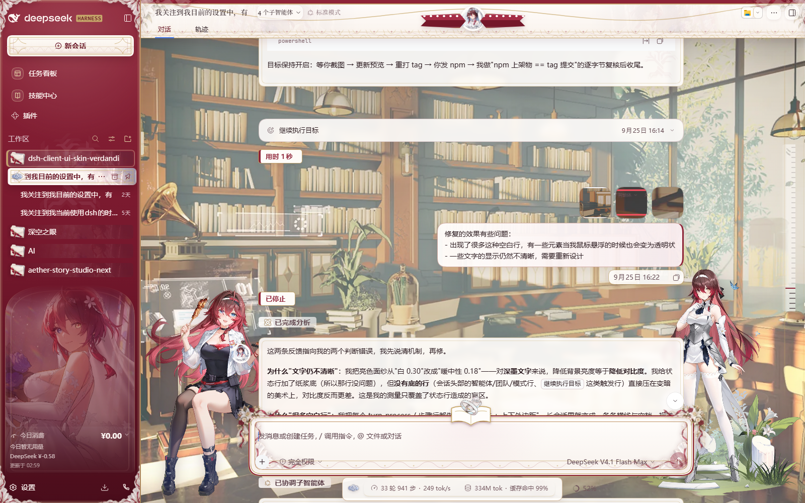
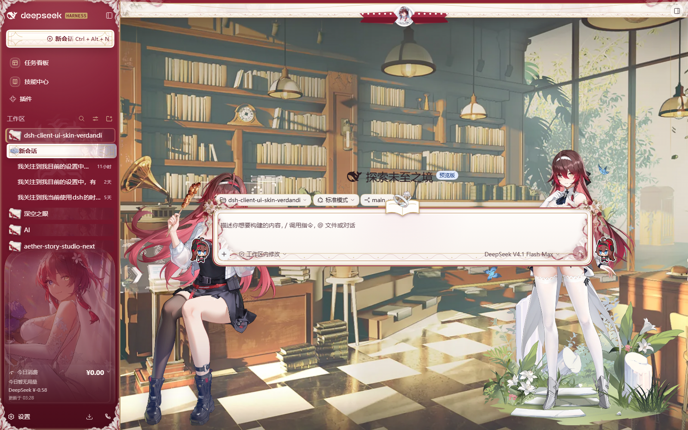
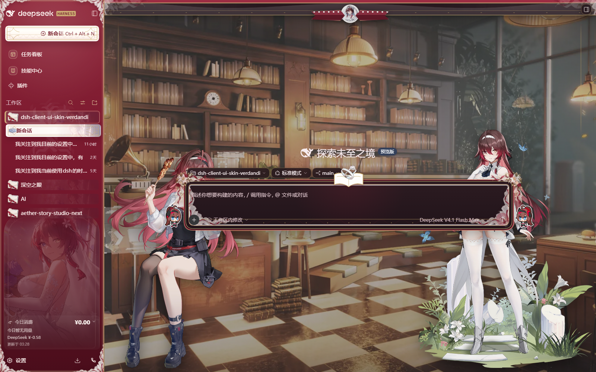
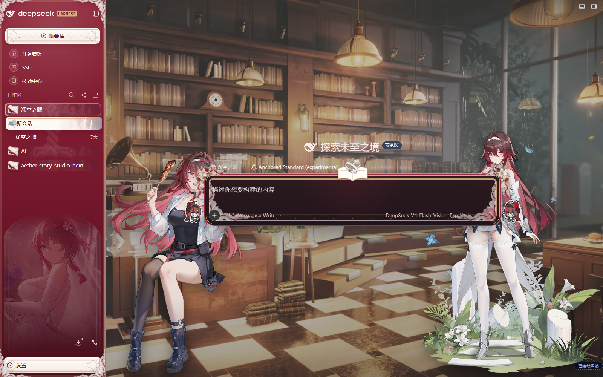
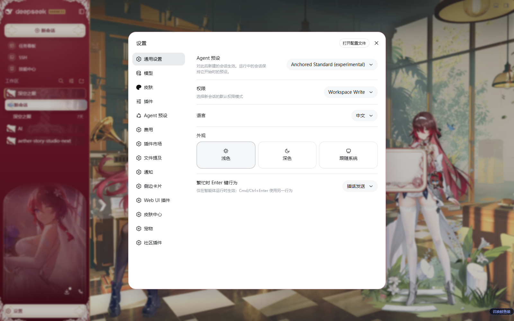

# Verdandi · White Vow

> An Aether Gazer Verdandi-themed skin plugin for the DeepSeek Harness Web UI.

**Language / 语言:** [简体中文](README.md) | [English](README.en.md)

[Design specification](docs/design/verdandi-white-vow.md) · [Release checklist](RELEASING.md) · [Asset and rights notice](THIRD_PARTY_NOTICES.md)





## Features

- Deep crimson `#8E2438` identifies navigation, identity, and selected conversations; bridal white keeps reading and editing areas clean; soft gold is reserved for knight crests and interaction details.
- Styles the sidebar, conversation header, chat history, composer, statistics dock, trace view, details pane, settings dialogs, and terminal hosts.
- Incorporates Verdandi motifs including the vow namecard, bridal portrait, rings, Sacred Tree, Sequence Sword, barbecue, and chibi artwork.
- Uses separate light and dark workspace scenes. The character stage scales smoothly with conversation state and adapts to narrow windows, collapsed sidebars, and reduced-motion preferences.
- Keeps the scenic stage while a legibility guard protects text contrast: a bridal veil that only drops when a transcript is present, plus a paper slip behind every process-metadata row and every new-session workspace chip (system prompt, turn failure, process control, turn-tail clock and actions, workspace / preset / branch chips). Worst-case ink ratios are ≥5.3:1 in both palettes.
- Presentation only: the plugin registers no service, does not read or modify model requests, and uploads no data.





## Installation

Verdandi ships in two forms; pick one for your setup. **Do not enable both at the same time** — they load the same visuals through different mechanisms, and enabling both stacks their rendering.

### Option 1: skin marketplace (recommended)

For dsh `0.1.7-rc.2+` setups with the skin center installed (it ships with the dsh-web bundle; `1.0.2+` trusts this skin's hooks):

1. Open “Settings → 皮肤 (Skin)” and find “薇儿丹蒂 · 纯白圣誓 (Verdandi · White Vow)” in the skin list.
2. Click 试穿 (try on) for an instant, uncommitted preview; click 应用 (apply) to persist — the page refreshes itself.
3. The skin installs as a pure asset directory into the DSH home. **No install command, no restart** — reopening the skin card or refreshing the page picks it up.

The marketplace version (`1.0.x`) is independent of the npm plugin version (`0.1.x`); marketplace updates are also done by re-downloading there.

### Option 2: standalone plugin

For setups without the skin center, or if you prefer npm versioning and command-line updates.

Install from npm:

```powershell
dsh plugin --profile web add @hjbztlbr/dsh-client-ui-skin-verdandi
```

Or from GitHub:

```powershell
dsh plugin --profile web add github:Sddft97/dsh-client-ui-skin-verdandi
```

After installation, enable “Verdandi · White Vow” in the plugin/skin manager and press `Ctrl+F5` to force-refresh the page.

### Notes

- When one form is enabled, make sure the other stays disabled.
- Full skins modify many of the same host surfaces, so keep only one enabled at a time.

## Appearance modes

Choose Light, Dark, or Follow System under “Settings → General → Appearance” in DSH. If DSH is set to a fixed appearance, changing only the browser or operating-system theme will not override it.

## Update and uninstall

**Skin marketplace install**: update by re-downloading in the skin marketplace; uninstall from the skin list, or delete `skins/verdandi/` under the DSH home and refresh the page.

**Plugin install**:

```powershell
# Update
dsh plugin --profile web update @hjbztlbr/dsh-client-ui-skin-verdandi

# Uninstall
dsh plugin --profile web remove @hjbztlbr/dsh-client-ui-skin-verdandi
```

## Compatibility

- Tested with the DeepSeek Harness `0.1.5-rc.1` and `0.1.7-rc.2` Web profiles; on 0.1.7 both the skin-center `1.0.2` asset form (hooks trusted) and the plugin form were verified: 0.1.7 rebuilt the session header (`conversation.header`), the trigger rows, the user-echo clock row, the context notice rows, the work-steps fold and the turn-process ribbon. All are handled, and the older shell renders unchanged.
- Uses scoped compatibility styles for better-sidebar, AionUI, SSH, Cordis, `.xterm`, and settings portals without replacing terminal ANSI colors or broad system tokens.
- Decorative avatars and character artwork are hidden at smaller viewport sizes so controls and text remain usable.



DSH is evolving quickly. If an upgrade causes selector or layout regressions, open an Issue with the DSH version, browser version, affected page, enabled plugin list, and a screenshot.

## Troubleshooting

### The skin is installed but nothing changes

Confirm that the plugin is enabled and other full skins are disabled, then press `Ctrl+F5`. If the problem remains, check the browser console for `__ModuleLoader__` or client-bundle loading errors.

### Buttons or text have poor contrast in Settings

Temporarily disable other plugins that replace global theme tokens. This skin applies compatibility rules only to known DSH host surfaces; include the list of enabled plugins when reporting a reproducible conflict.

### The dark background does not switch

Change the appearance in DSH itself. Browser dark-mode preferences take effect only when DSH is set to Follow System.

## Local development

```powershell
pnpm install
pnpm build
pnpm test
pnpm typecheck
dsh plugin --profile web add link:C:/absolute/path/to/dsh-client-ui-skin-verdandi
```

The package follows the DSH skin-plugin structure: `cordis.patch.yml` registers the bundle row, `skin.json` provides skin metadata, and the client keeps a reversible `apply()` / `dispose()` contract. Runtime styles are scoped under `body[data-dsh-verdandi]`.

## License and assets

Repository code, CSS, build scripts, and original generic ornaments are available under the [MIT License](LICENSE). Character art, scenes, icons, and processed assets from Aether Gazer are excluded from the MIT grant and remain the property of their respective rights holders. This is a free, non-commercial, unofficial fan skin with no affiliation with or endorsement by the game's developers, publishers, operators, or the DeepSeek Harness project.

See [THIRD_PARTY_NOTICES.md](THIRD_PARTY_NOTICES.md) for the full asset boundary. A [Simplified Chinese translation](THIRD_PARTY_NOTICES.zh-CN.md) is also available. Rights holders may request attribution corrections, replacement, or removal through GitHub Issues.
