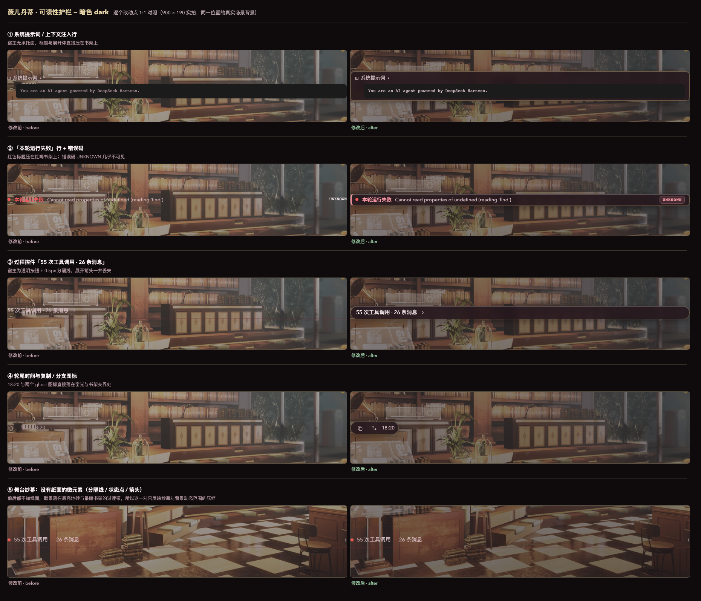
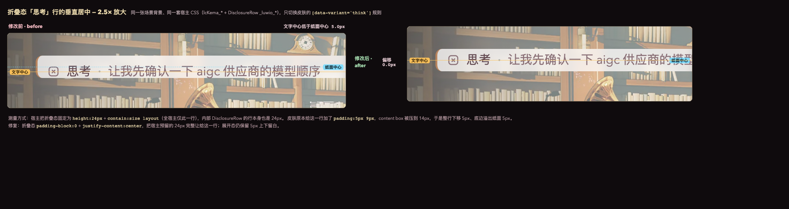
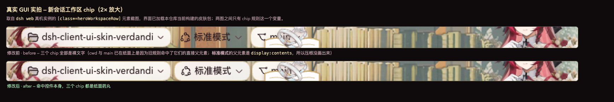
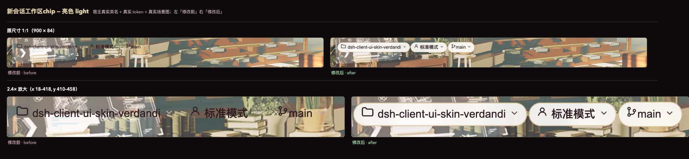
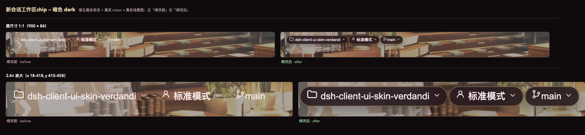
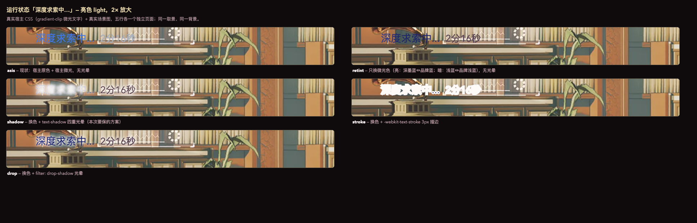
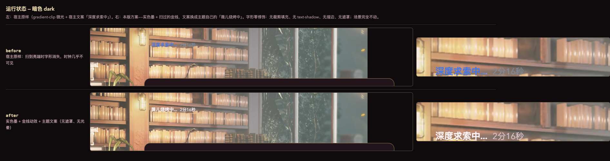
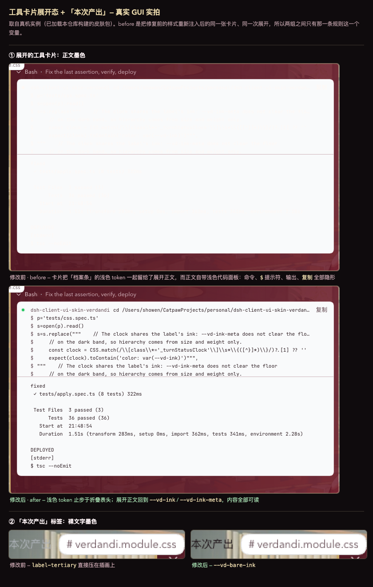
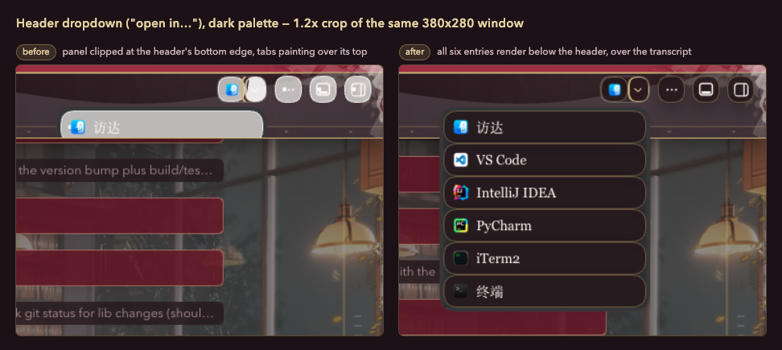
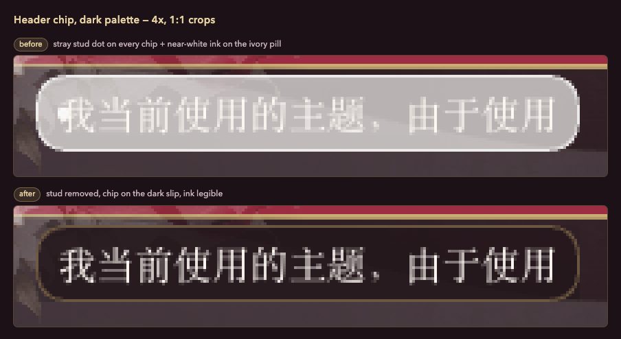

# 薇儿丹蒂 · 纯白圣誓（White Vow）设计说明

## 1. 设计目标

这套皮肤不是把 DSH 全局染成红色，而是建立清楚的空间分工：

- 深红 `#8E2438`：只负责导航、身份与状态，集中在左侧栏、按钮轮廓和选中态。
- 婚纱白 `#FFFDFC`：负责誓约顶栏、阅读书页、输入框和系统弹窗。
- 柔金 `#C7A86B`：只负责边框、选中态和骑士纹章，不承担大面积填充。
- 墨褐 `#2C1C21`：正文主色，保证亮色模式的长文本可读性。

关键词是「乐观、守护、誓约、圣树、精灵骑士」。“贪吃/烤肉”保留为微型彩蛋，不进入主视觉中心。

## 2. 参考主题拆解

`@dsh-external/dsh-client-ui-skin-maid-atelier` 的可复用方法不是蓝金配色本身，而是它的分层方式：

1. 背景、人物、结构框、功能控件分别处于独立层级。
2. 装饰层永远不遮挡真实按钮，也不改变按钮点击区域。
3. 侧栏、顶栏、输入区各有独立视觉身份，而不是依靠全局 token 一次性换色。
4. 会话/工作区选中态使用可伸缩的徽章或丝带，适配动态宽度。
5. 设置、终端、第三方面板拥有单独的高对比兜底，不继承皮肤正文颜色。
6. 角色图在宽屏是舞台，在窄屏自动退场；设置/弹窗打开时降低装饰层级。

本主题只借鉴这些布局和交互原则，不复制 Maid Atelier 的美术资产。

## 3. 角色与美术语义

官方角色资料将薇儿丹蒂描述为充满活力与热情、乐观坚强，并希望守护世界与喜爱的人；婚纱换装「致未来的我们」与额外内容「纯白之誓」提供了“纯白、玫瑰、誓约”的明确视觉锚点；角色主题曲则把“承诺、守护、同行”作为核心叙事。

因此美术元素按重要度排序：

1. 婚纱/纯白骑士立绘：主角色元素，只出现在对话区右侧留白舞台。
2. 长剑与誓约纹章：顶栏和选中态的主要标识。
3. 圣树枝叶/卢恩式线纹：背景水印和边角纹样。
4. 玫瑰岭花瓣：输入卡片与空会话页的轻装饰。
5. 烤肉签：侧栏 footer 或输入区状态旁的 14–16 px 彩蛋。

## 4. 页面区域设计

### 4.1 左侧栏：深红邀请函

- 使用从 `#6B1728` 到 `#8E2438` 的低对比纵向渐变。
- 内侧是一圈 1 px 柔金框，四角使用原创的纯白薄纱、蕾丝、珍珠与深红丝带角饰；顶部与底部使用细蕾丝分隔。
- DeepSeek Logo 保持原结构；HARNESS 铭牌改为柔金底、深红字。
- “新会话”是象牙白邀请函按钮，双线边框和轻微内阴影，禁止纯白无字状态。
- 工作区标题使用金色小标题；搜索/筛选/添加按钮统一为 30–32 px 图标按钮。
- 活跃工作区使用深红中的浅亮丝带；活跃会话改为象牙白邀请函与戒指标识，移除容易和侧栏底色粘连的深红燕尾色块。
- 工作目录保留誓约名片裁切，并用原创象牙白邀请函文件夹、深红丝带和戒指扣替换宿主默认文件夹图标。
- 底部婚纱 CG 裁入拱门形画框，使用暗红渐隐与低透明度融入 footer，而不是叠一张独立人物卡；侧栏折叠时完全消失。
- 余额、今日、设置区域放在半透明深红 footer 上，与背景人物保持足够对比。

### 4.2 会话顶栏：头纱誓约冠带

- 直接美化宿主的 `conversation.session.header`，不添加覆盖整个 header 的 fixed 元素。
- 将誓约名片以低透明度双侧裁切融合进顶栏；工作目录只使用压暗的小幅名片裁切，会话选中态保留完整亮色邀请函表达，三者层级明确。
- 顶栏两端使用原创的白百合、深红玫瑰、金叶、薄纱与丝带角花，全部位于真实控件下层且不参与点击。
- 高度跟随宿主；主体为象牙白头纱，顶部只保留 7 px 深红誓约线和 1 px 柔金压边。
- 中央使用原创玫瑰花束、双戒与垂落丝带，底部铺一条轻蕾丝；不使用带背景的大图。
- 会话标题、Session log 与 tabs 使用墨褐或暗色模式婚纱白，并始终位于装饰层上方。
- 标签页选中态使用深红文字与柔金下划线；标签自身保持平面透明，不套用通用圆形按钮背景，也不改变 tab hitbox。

### 4.3 主工作区：玫瑰岭昼夜舞台

- 对话 pane 在亮/暗主题分别使用昼景与夜景；移除横跨工作区的中央白遮罩，让背景和两侧人物形成完整舞台。
- 可读性由每条聊天内容自己的半透明婚纱白/墨褐“誓约书页”承担，而不是洗白整张背景。
- 助手消息是白色“书页卡”，用户消息是非常浅的玫瑰白；工具调用保持宿主结构，只增加细边。
- 代码块使用中性暖灰，不染成红底。
- 角色舞台挂载到 conversation pane 内部，`overflow: hidden`，位于内容之下、背景之上；左侧为烤肉坐姿，右侧为纯白骑士。
- 空会话人物约占可用高度 80%；开始工作后以 620 ms 缓动缩至整区约 50%，同时向两侧退让。
- 活跃会话中角色脚部落在 composer 上边界；右侧详情栏打开后，conversation 自身变窄，人物随 pane 边界自然左移。
- 助手正文卡左侧外置誓约头像框与婚纱头像，形成聊天软件式身份标记；头像不侵占书页内边距，窄屏自动隐藏并回收外侧间距。
- Composer 两个上角复用原创婚礼角花，内侧下角加入低透明度薄纱与丝带裙摆；中央仍由誓约书与戒指承担主焦点，避免角色素材与输入控件争抢注意力。
- 小屏或可用宽度不足时隐藏角色；任务看板、SSH 等工作区表层打开时保留底层人物舞台，功能面板继续以更高层级承载交互。

### 4.4 底部输入区：展开的誓约书

- Composer 是页面视觉重点：居中、象牙白实体底、深红外框、柔金内框、16–20 px 圆角。
- 顶部中央是展开的誓约书、双戒和玫瑰丝带印章；底边使用婚纱蕾丝/裙摆纹样。
- 左侧附件/权限按钮统一为圆形瓷白按钮；发送按钮为深红圆形主按钮。
- 输入文字与 placeholder 保持宿主字号；设置 112 px 的舒适最小高度但不固定高度，以兼容自动增高和新增薄纱内饰。
- 统计栏是低对比象牙白条，不与人物脚部重叠。

### 4.5 右侧详情栏

- 使用婚纱白实体面板，左侧 2 px 深红轨道和 1 px 金线。
- 标题区可加入 12 px 圣树叶标；正文与表单保持宿主高对比 token。
- 背景图只以 3–6% 可感知度存在于实体遮罩后，并叠加 4–6% 的圣树水印，正文区域仍是高对比面板。

### 4.6 设置、弹窗与第三方插件

- 设置页优先保持 DSH 默认背景/文字 token，只增加深红 accent、金色 focus ring 和分区边线。
- 设置弹窗虽然从侧栏节点 portal 出来，但打开时必须临时解除侧栏的 `overflow/isolation` 裁切并提升其层级；关闭后恢复侧栏装饰上下文。
- 不使用 `[role='dialog'] *`、全局 `button` 或宽泛 `[class*='message']` 改色。
- `.xterm` 不覆盖其 canvas/viewport 背景与 ANSI 颜色，只美化外层 panel 和焦点边框。
- `data-cordis-panel`、better-sidebar、aionui 仅在明确容器上设置背景和边框。
- 所有装饰 `pointer-events: none`、`aria-hidden: true`；弹窗打开时装饰舞台降到内容后方。

## 5. 交互与响应式

- Hover：背景亮度提升约 6%，最多上移 1 px。
- Focus visible：2 px 柔金轮廓 + 1 px 深红外圈。
- Active：不依赖纯色填充，必须同时有边框/刻线，避免色觉歧义。
- `prefers-reduced-motion`：关闭丝带、人物与 Composer 的位移动画。
- `< 1080 px`：人物缩小并降低透明度；`< 840 px`：人物和侧栏背景角色全部隐藏。
- 侧栏 rail 模式：隐藏文字装饰，只保留统一的 16 px 图标按钮和金色选中环。面板行的字形不带各自的外环（见 15.13），所以展开态与 rail 态的图标尺寸一致。

## 6. 实现约束

- 仅使用稳定 `data-pane`、`data-slot`、`data-phase` 和皮肤自有 `data-verdandi-*` hook。
- 对无法稳定定位的会话/工作区行，由 JS 添加皮肤自有语义属性，再由 CSS 美化。
- MutationObserver 必须批处理到 `requestAnimationFrame`，不在每个流式 token 上同步测量全页面。
- 角色舞台必须挂在 conversation pane 内，禁止 `position: fixed; z-index: 9999`。
- 删除旧 `.verdandiSidebarCard` 路径和未使用的 500×740 卡片资源。
- 保留 `apply/dispose` 可逆性，不注入服务、不碰模型请求。

## 7. 素材来源与使用边界

- 官方角色主页：[Aether Gazer — Verthandi](https://www.aethergazer.com/home)
- 官方角色资料：[黯耀·薇儿丹蒂情报追加](https://www.taptap.cn/moment/542748048204238595)
- 官方婚纱换装：[致未来的我们 / 纯白之誓](https://www.taptap.cn/moment/609036156754987398)
- 官方角色 PV：[现在屹立于此](https://www.taptap.cn/moment/539777435990755201)
- 官方主题曲：[My Precious Friend](https://www.bilibili.com/video/BV1Zf42117a1/)

当前仓库中的栅格资产缺少逐项来源和授权记录。实现阶段可以继续用于本地视觉验证，但发布前必须补齐来源、作者、原始链接、裁切/抠图说明和再分发边界。未取得明确许可的二创不进入仓库；缺失的小装饰优先使用原创 CSS/SVG 绘制。

## 8. 验收矩阵

| 场景 | 验收点 |
|---|---|
| 活跃会话 | 标题、Session log、tab 可读；人物不盖文本；脚部不被 Composer 裁切 |
| 空会话 | 背景和角色形成完整构图；Composer 是视觉中心 |
| 侧栏展开/收起 | 背景人物与装饰随侧栏消失；图标仍清晰 |
| 右侧详情开/关 | 人物随 conversation 宽度退避，不进入 details |
| Composer 多行 | 高度自动增长；边框不变形；统计栏不重叠 |
| 设置页 | 浅色与暗色文字均清晰，不出现全白控件 |
| xterm / Cordis / aionui | 保留插件自身颜色语义，无透明穿透和文字丢失 |
| 840 / 1080 / 1280 / 1600 px | 无横向遮挡，角色按断点退场或缩放 |

## 9. 「玫瑰岭晨誓」V2 素材与构图决策

- 左侧人物采用烤肉坐姿薇儿丹蒂，承担“活泼、贪吃、烤肉”的性格叙事。
- 右侧人物采用纯白骑士立绘，承担“守护、圣誓、花草与圣树”的主视觉叙事。
- 空会话 `hero` 阶段以可用会话高度约 80% 展示双人物；开始对话后平滑缩放至约 50%，并向外侧退让。
- 亮色与暗色背景分别使用书室昼景和夜景；移除中央高遮罩，以独立消息书页保证阅读对比。
- 用户追加的婚纱 CG 采用竖幅近景裁切，放入侧栏下半部的拱门画框；这张图不适合作为全屏背景，也不与主舞台立绘竞争。
- 顶栏和输入区缺失的婚礼装饰全部使用仓库内原创 SVG 绘制：头纱曲线、花束、双戒、丝带、誓约书和蕾丝，不再依赖未授权二创素材。
- 人物响应式以 conversation 实际宽度为准：宽屏双人物，中屏缩小，窄屏只保留右侧，极窄屏全部隐藏。
- 当前素材由用户为本地迭代提供，原始链接、作者与再分发许可尚待确认；发布前不得将其标记为已确认官方授权素材。

## 10. V2 实机结论

- 1920×1080 亮色：红色只占侧栏；顶栏、消息卡和 Composer 形成连续的婚纱白主轴，昼景保持清晰。
- 1920×1080 暗色：顶栏与 Composer 转为墨褐，柔金轮廓保留；夜景和人物同步降亮度。
- 昼夜状态跟随 DSH「通用设置 → 外观」的浅色、深色或跟随系统偏好；皮肤同时为宿主透明滚动条槽提供对应根底色，避免最右侧露出白边。
- 设置弹窗：浅色恢复宿主黑字白底，暗色恢复宿主深底白字，不继承侧栏红色 token。
- 侧栏 rail：宽度收至 56 px 时婚纱 CG 隐藏，conversation 扩宽并重新测量人物舞台。
- 所有婚礼装饰均为 `pointer-events: none` 且在 `dispose()` 时清理，不覆盖标题、按钮或模型请求链路。

## 11. V3 第一轮官方美术强化

- 顶栏中央使用誓约头像框与婚纱头像组合成正式身份徽章，替换通用花束中心图形。
- Composer 保留展开的誓约书结构，并将官方戒指图作为唯一焦点叠放在书页上方。
- 当前会话行使用誓约名片作底图、戒指标签作左侧状态徽记；渐变遮罩继续承担文字对比。
- 纯白圣树图通过 alpha mask 染色，用于深红侧栏和右侧详情栏水印，禁止直接铺在白底上。
- 两张 Q 版薇儿只在空会话 hero 阶段出现于 Composer 外角；开始对话、窄屏和 reduced-motion 场景不参与持续动画。
- 第一轮不使用童年唱片、时序之剑新图和 Q 版头像，留作低频空状态与 rail 模式彩蛋，避免正式誓约主轴被稀释。

## 12. V3 第二轮誓约界面强化

- 时序之剑只进入“轨迹”时间轴与发送按钮的短促光效：前者表达任务推进，后者表达誓约启程，不重复铺入正文。
- 右侧详情栏在无工具详情时转为“誓约档案”空状态，童年唱片作为低透明度藏品陈列；工具详情出现后立即退出。
- 侧栏收起为 rail 时，使用誓约头像框承载 Q 版头像，作为不占用导航 hitbox 的身份徽记；展开态仍以婚纱 CG 为主。
- 顶栏头像冠带增加深红丝带翼、柔金扣与珍珠按钮边线，继续保持标题、Session log 和标签页位于可交互前景。
- 助手消息采用带圣树角印的誓约书页，用户消息采用玫瑰白回函；工具与重试行使用墨褐档案条，代码块和终端保持中性色。
- 所有新增装饰均为 `aria-hidden`、`pointer-events: none`，且仅在稳定语义状态出现；不添加持续旋转或高频闪烁动画。

## 13. V3 第三轮状态叙事强化

- Composer 统计栏使用戒指标签作为左端徽记、圣树作为低透明度水印；它与输入卡保持独立的完整圆角边框，宿主悬浮提示不参与统计栏网格排版，也不注入或改写费用数据。
- 轨迹时间轴只保留主题化边框、底色和宿主数据，不叠加角色或武器素材；宿主未提供可靠运行状态，因此不伪造执行进度动画。
- 右侧详情栏保持同一“藏品柜”位置：仅在详情栏展开且尚未选中工具行时出现，聊天视图展示童年唱片，轨迹视图展示时序之剑；选中真实工具详情后立即隐藏藏品。
- 空会话人物舞台保持纯立绘构图，不再叠加烤肉吊牌，避免与婚纱誓约主视觉争夺注意力。
- 新增元素继续遵守 `aria-hidden`、`pointer-events: none`、reduced-motion 和 apply/dispose 清理契约。

## 14. V3 第四轮婚纱结构强化

- 侧栏原有通用金线框收敛为细柔金结构线，四角改用原创纯白薄纱、蕾丝、珍珠与深红丝带资产，形成明确的婚纱裙摆语义。
- 工作目录行保留誓约名片底图，默认文件夹图标替换为原创象牙白邀请函文件夹；活跃会话移除深红燕尾块，以戒指标签和白色邀请函承担选中层级。
- 任务看板、SSH、技能中心统一为 24 px 图标槽，解决不同宿主图标尺寸造成的文字起始线错位。
- 顶栏两侧叠加低透明度头纱角饰，但 tabs 改为透明平面样式，避免圆形按钮背景和文字宽度冲突。
- 助手婚纱头像使用独立外侧挂槽，不缩短消息书页且保持各类消息左边界对齐；840 px 以下隐藏头像。Composer 提升至 112 px 最小高度，并在内侧下角加入头纱/裙摆装饰。
- 人物舞台通过皮肤级 `display` 保护保持挂载；任务看板和 SSH 的真实功能表层仍位于舞台上方，不改变宿主交互和路由。

## 15. 可读性护栏（亮/暗双模）

### 15.1 问题

工作区使用写实插画背景，同一帧内亮度从近黑书架跨到近白窗光。此前版本的语义是「移除横跨工作区的中央白遮罩，让背景与两侧人物形成完整舞台」，可读性交给每条聊天内容自己的誓约书页；这个分工覆盖了**正文**（助手书页卡、用户回函、工具/重试档案条都有承托面），但宿主把**轮次过程元数据**直接绘制在工作区上：

| 行 | 宿主实现 | 是否有承托面 |
|---|---|---|
| 系统提示词 / 上下文注入 | `XrJvXW_root` | 无（仅展开体是代码块） |
| 本轮运行失败 / 达到 token 上限 | `turnErrorRow` | 无 |
| 过程控件「55 次工具调用 · 26 条消息」 | `l_V-RG_root` | 无（透明 + 一条 0.5px 分隔线） |
| 轮尾时间与复制/分支图标 | `xzv4MW_actions` | 无 |
| 工具调用 / 重试 | `_callRow` / `_retryRow` | 有（墨褐档案条，V3 已覆盖） |

插画亮度在同一帧里跨度过大，**任何单一文字色都无法在两种主题下同时成立**。宿主继承色在这些区域的实际表现：

| 主题 | 文字 | 背景 | 对比度 |
|---|---|---|---|
| 亮 | `label-tertiary` `#81858c` | 纯白（理论最好情况） | 3.71:1 |
| 亮 | `label-tertiary` `#81858c` | 插画中间调 | 1.25:1 |
| 亮 | `label-secondary` `#61666b` | 插画中间调 | 1.96:1 |
| 亮 | `state-error` `#ec1313` | 插画中间调 | 1.52:1 |
| 暗 | `label-tertiary` `#adb2b8` | 棋盘白格 | 1.41:1 |
| 暗 | `state-error` `#f25a5a` | 棋盘白格 | 2.18:1 |

注意亮色第一行：宿主的三级文字色在**纯白上也达不到 WCAG AA 4.5:1**。因此这不属于「把背景再调淡一点」可以解决的问题，必须有承托面。

### 15.2 三层护栏

1. **舞台纱幕（`--vd-stage-veil`）**：在 conversation pane 的背景层叠一条中心强、两翼弱的横向渐变纱幕（亮 `rgba(255,253,251,.30)`、暗 `rgba(18,11,15,.24)`，两翼分别为 `.12` / `.10`）。它只压缩插画自身的动态范围，压不到人物舞台（舞台是 pane 的子节点，绘在背景之上），因此两侧人物保持鲜明；`hero` 空会话阶段没有文字要承接，纱幕自动升到近乎全透（`--vd-stage-veil-hero`）。纱幕解决的是**没有承托面的微元素**：分隔线、状态点、展开箭头、hover 底色。
2. **承托面（`data-verdandi-slip` / `.slip` 家族）**：上述四类裸行获得半透明纸面（`--vd-slip`）+ 1px 柔金线 + 圆角 + `backdrop-filter: blur(7px)`。失败行额外获得 3px 深红左规、专属 `--vd-danger` 标题色和「UNKNOWN」错误码芯片；过程控件从透明分隔线变为同一家族的通栏缎带；轮尾图标行变为小圆药丸。文字色通过在该行上重设 `--dsw-alias-label-secondary/tertiary/caption` 一次性覆盖全部后代。
3. **对比保底**：`--vd-ink-meta` / `--vd-danger` / `--vd-warn` 三个新墨色按「90% 纸面压在最暗插画像素上」的最坏情况取值，两种主题下**全部 ≥5.3:1**（见 `tests/css.spec.ts` 的 `verdandi legibility contrast floor`，它按 WCAG 公式逐一断言）。`backdrop-filter` 不可用时退回 `--vd-slip-solid` 不透明面；`prefers-contrast: more` 加强纱幕并去模糊；`forced-colors: active` 交还系统配色。

### 15.3 实现约束

- 只新增两个稳定钩子：宿主的 `[data-turn-process]`、`[data-turn-tail]` 数据属性，以及失败/压缩行的 `_turnErrorRow` / `_compactionRow` 类名后缀（与已有的 `_markdown_` / `_userRow` 同一契约）。
- 唯一需要运行时打标的是系统提示词行：它没有可用的类名或属性锚点，由 `decorateLegibilityRows()` 从 `[data-system-prompt-body]` 上溯到 node seat，写入 `data-verdandi-slip="context"`；`dispose()` 会清空全部 `data-verdandi-slip`。
- 全部新增面均为 `pointer-events` 语义不变、不新增节点、不改变宿主层级，也不引入持续动画。
- 不想看到纱幕时只改一个变量即可（例如在自定义 CSS 里 `body[data-dsh-verdandi] [data-pane='conversation'] { --vd-stage-veil: 0.14; --vd-stage-veil-edge: 0.05 }`）；承托面单独就能守住对比度下限。




两张对照图逐项列出 ① 系统提示词行、② 运行失败行与错误码、③ 过程控件、④ 轮尾时间与操作图标、⑤ 舞台纱幕，左「修改前」右「修改后」，取景为 900 × 190 的真实场景实拍；⑤ 前后刻意都不加纸面，用来单独说明纱幕只压缩背景动态范围、并不独自承担对比度。

### 15.4 折叠态「思考」行的垂直居中

折叠的推理行本身需要一个与宿主固定行高配合的垂直居中：

- 宿主把这一行固定成 `height: calc(24px + font-delta)` 并加 `contain: size layout`（全宿主唯一一处），内部 DisclosureRow 的 `._row_` 自身也是同一高度。
- 本皮肤的 `[data-variant='think']` 规则给该行加了 `padding: 5px 9px` + `box-sizing: border-box`，content box 被压到 14px，于是 24px 的行走不到 24px 的盒子中央：整行下移 5px，底边溢出纸面 5px。此前没有纸面，该偏移不可见；加上纸面后必须一并修正。
- 修正方式：折叠态 `padding-block: 0` + `justify-content: center`，把宿主预留的高度完整让给这一行；展开态由内容撑高，保留原有上下留白。修正后行偏移与底边溢出均为 0。



### 15.5 新会话工作区 chip 的承托面

空会话阶段的 chrome 同样是裸的：工作区行的三个 chip。`hero` 阶段并非「没有正文所以不需要护栏」——恰恰相反，它正是 chip 最集中的时候。

| chip | 归属 | 类名 | hero 态样式 |
|---|---|---|---|
| 工作目录 | 宿主 `WorkspaceChip` | `pXSMma_workspace` | 透明，`label-primary` |
| 标准模式（agent preset） | 宿主 `AgentPresetSeat` | `cubgiG_seat` | 透明，`label-primary` |
| 分支 main | 第三方插件 `ui-git-graph` | `_7rgC5q_chipHero` | 透明，`label-primary` |

三者的几何完全一致：高 28px、圆角 16px、`padding: 0 8px`、13px、透明底——宿主是把它们当作**一组 chip 家族**设计的，默认假设工作区背景不透明。

承托面若只加在**这一行的直接子元素**（`> *`），只有工作目录与分支两个 chip 生效，「标准模式」不会：宿主 slot 系统给每个 seat 套了一层 `display: contents` 的 div，它不生成任何盒子，纸面会画在一个 0 × 0 的不可见元素上，真正的 `button.cubgiG_seat` 仍是透明的。而分支 chip 是插件用 `querySelector('[class*="heroWorkspaceRow"]')` 直接 append 进来的真实盒子，因此它与同样是直接子元素的工作目录 chip 都能命中——这就是「三个看起来一模一样的 chip，两个生效一个不生效」的结构性原因。

因此规则命中**行内任意深度的控件**：

```css
:is([class*='_heroWorkspaceRow'], [class*='_workspaceRow']) :is(button, [role='button'])
```

宿主 chip、插件 seat、以及后续新增的 seat 都在覆盖范围内；展开后的菜单面板被 portal 到 `document.body`，所以该后代选择器不会误伤菜单项。



### 15.6 纱幕的作用边界

一个容易误判的点：alpha 合成发生在 **sRGB 空间**，用线性亮度估算会显著高估纱幕的提升量。乳白纱幕压在纯黑上的实测结果：

| 乳白纱幕 | 压在纯黑上得到 | 与墨色 `#2c1c21` 的对比度 |
|---|---|---|
| 0.30 | `rgb(77,76,75)` | 1.89:1 |
| 0.50 | `rgb(128,127,126)` | 4.03:1 |
| 0.70 | `rgb(179,177,176)` | 7.59:1 |

也就是说，仅靠纱幕把暗部拉到可读需要 0.5 以上的不透明度，插画会被冲掉。**结论：纱幕只负责降噪（让分隔线、状态点、箭头、hover 底色有边界），对比度下限必须由纸面承担**；`prefers-contrast: more` 因此走「纸面变实心 + 纱幕加强」双管，而不是只加强纱幕。

保留一个已知取舍：hero 阶段 26px 的「探索未至之境」标题是唯一没有纸面的文字，纱幕保持近乎全透（0.06）以保住空会话插画。它落在画心中部的中间调区域，实测可读；若日后要收紧，三条路各有代价——给标题加纸面铭牌（改变 hero 构图）、加柔光描边（字形发糊）、或把 hero 纱幕提到 0.4+（明显冲淡插画）。





### 15.7 运行状态行：纯文字方案与已知缺口

这一处状态行（宿主的 `.turnStatus`）是会话流的最后一个子节点，位置随内容滚动，背景落在插画中任意一块。设计前先量出可用区间：

| | 亮度区间 | 单一实色墨的理论上限 |
|---|---|---|
| 亮色（昼景 + 纱幕 .30） | 0.245 – 0.708 | **4.8:1** 勉强过 AA |
| 暗色（夜景 + 纱幕 .24） | 0.062 – 0.423 | **2.05:1** 无论选什么颜色 |

由此得到一条硬约束：**「无承托面 + 无光晕 + 可见扫光 + 任意位置都 ≥4.5:1」四者不可能同时成立**，任何可见的扫光都要从这个上限上再削一刀。

评估过但未采用的方案：

| 方案 | 未采用的原因 |
|---|---|
| 宿主原样（`background-clip: text` 微光扫光） | 亮端 `#d3e2ff` 在乳白上只有 1.29:1，扫过时字形直接消失 |
| 重上色扫光 + `text-shadow` 四重光晕 | 光晕本质是在字形周围伪造一小块纸面；14px 中文被明显糊化 |
| 输入卡纸面向上渐隐 220px | 对比度达标且字形锐利，但该遮罩压在插画上读起来像一块雾 |

另外两条经实测淘汰：`-webkit-text-stroke: 3px` 会吃掉填充（除非配 `paint-order`）；`filter: drop-shadow()` 有效但弱于 `text-shadow`。候选对照见 `preview/options-status-{light,dark}.webp`。

最终采用的是纯文字方案：

- **实色墨**：不用裁剪填充、不加 `text-shadow`、不加描边、不加任何遮罩，场景保持不动。状态行单独用 `--vd-status-ink`（比正文墨更深）把亮色的余量从 4.50:1 提到 **5.1:1**。
- **动效搬到金线**：宿主那条会吃掉对比度的 `background-position` 动画改为关闭，改由 `::after` 上一条 2px 柔金刻线扫过。动效回到主题自己的语汇，且**在原理上不可能影响对比度**。
- **文案换成主题自己的**：宿主渲染 `chat.deepDiving`（「深度求索中…」），皮肤把这枚文本节点压成 `font-size: 0`，再用 `::before` 重新写「薇儿烧烤中…」。宿主按当前语言设置 `documentElement.lang`，所以 `:lang(en)` 下自动切成英文。DOM 不变、`dispose()` 即还原；无障碍读到的是宿主自己的本地化文案。
  - 需要注意的选择器冲突：`[class*='_turnStatus']` **同时命中 `_turnStatusClock`**，所以两条规则都必须 `:not([class*='_turnStatusClock'])`，否则时钟会继承 `font-size: 0` 并多出一份标签。

**已知缺口**：暗色下这块文字的最坏情况只有约 **1.9:1**，且这已是纯文字方案的理论极限（该区间最优单色 2.05:1）。因此测试只对亮色断言 ≥4.5:1，对暗色断言 ≥1.9 作为回归下限，并把两端实测值写进 `STATUS_BAND` 常量。若日后要补上暗色，只有两条**不伤字形**的路径：把暗色 pane 纱幕从 0.24 提到约 0.5（整幅夜景变暗，但无可见遮罩边界），或给字形加 `paint-order: stroke fill` + `-webkit-text-stroke` 的细描边。





### 15.8 工具卡片展开态：浅色 token 的适用范围

V3 给工具调用行加的「墨褐档案条」把 `--dsw-alias-label-primary/secondary/tertiary` 整体改成了浅色（`#fff8f4` / `#f0dce1` / `#dcbfc7`）。但该规则命中的 `_callRow` **包住的不只是折叠表头，还有整个展开正文**，而正文自带一块浅色代码面板（宿主的 code-block 底色，亮色下是 `#f9fafb`），于是形成「浅色文字 + 浅色面板」，整块正文不可读。

宿主的容器结构是明确的：**每张工具卡都把展开正文包在 `*_bodyWrap` 里**（Bash 卡是 `CY-8Ka_bodyWrap`，diff 卡是 `o3BgMG_bodyWrap`），表头是它的兄弟节点。因此把浅色 token 的作用域收回表头一侧即可：

```css
:is([class*='_callRow'], [class*='_retryRow']) [class*='_bodyWrap'] {
  color: var(--vd-ink);
  --dsw-alias-label-primary: var(--vd-ink);
  --dsw-alias-label-secondary: var(--vd-ink-meta);
  --dsw-alias-label-tertiary: var(--vd-ink-meta);
  --dsw-alias-label-caption: var(--vd-ink-meta);
}
```

实测（展开的 Bash 卡）：表头标题仍是 `rgb(240,220,225)` 浅色；`_bodyWrap` / `_prompt` / `_line` 变为 `rgb(44,28,33)`，`复制` 为 `rgb(95,69,77)`（在 `#f9fafb` 面板上 7.3:1）。

### 15.9 无承托面文字统一到 `--vd-bare-ink`

「本次产出」标签来自 `dsh-better-sidebar` 的 `_producedLabel`（`color: var(--dsw-alias-label-tertiary)`，压在插画上约 1.3:1），与运行状态行属于同一类问题，因此收进同一个墨色：

- `--vd-status-ink` 更名为 **`--vd-bare-ink`**，语义从「状态行专用」提升为「所有没有承托面、直接压在工作区画面上的文字」（运行状态行 + 本次产出标签 + `_producedMore`）。
- 亮色 `#1b1116`（比正文墨 `#2c1c21` 更深，把 4.50:1 提到 5.1:1），暗色 `#fbf3f5`。



### 15.10 顶栏下拉面板的裁切与层级

顶栏的下拉（标题面包屑、右侧「打开方式」chevron、更多菜单）需要在皮肤规则下完整显示，否则只剩贴着 header 底边的一条。

宿主结构：面板是 `[role='menu']`，`position: absolute; z-index: 100`，父链为 `_headerUtilities` → `_titleRow` → `[data-verdandi-header]`——**它由宿主绘制在 header 子树内部，没有 portal 到 `document.body`**（新会话 hero 行里的 preset 菜单则会 portal，两者结构不同）。header 只有 76px 高，面板底边以下会被剪掉。宿主 header 的默认值是 `position: static; z-index: auto; overflow: visible`。

把面板关进笼子的是本皮肤的两条规则：

1. header 的 `overflow: hidden` 直接剪掉超出 76px 的部分；
2. `[data-verdandi-header] > :not([data-verdandi-decoration]) { z-index: 3 }` 让 DOM 里靠后的 tab 行拿到同等层级，盖住面板顶部。

修正：header 不再 `overflow: hidden`（各装饰层自身是 `overflow: hidden`，会自裁），并把宿主的标题行 `[class*='_titleRow']` 提到 `z-index: 5`，让它压住 tab 行。

```css
body[data-dsh-verdandi] [data-verdandi-header] { /* 不再 overflow: hidden */ }
body[data-dsh-verdandi] [data-verdandi-header] > [class*='_titleRow'] { z-index: 5; }
```

验证方式：面板打开后取 4 个采样点（面板高度 5%/30%/60%/95%）做 `elementFromPoint`，全部落在 `[role='menu']` 内；亮/暗两态均通过。

**后续（0.2.0 回归）**：这里当时的写法 `> [class*='_titleRow']` 是 0-2-0，能赢只是因为宿主那时的标题行直接挂在 header 下、与 `z-index: 3` 那条同级且写在后面。0.2.0 把标题行塞进 `conversation.session.header` 这个 `display: contents` 座位后，`z-index: 3` 那条的后代形式变成 0-3-0，标题行规则反被压住——「更多操作」菜单又回到页签下面。见 **15.16**。



### 15.11 顶栏 chip 的装饰层与暗色墨色

暗色下每个顶栏 chip 左侧会出现一颗小圆点，亮色下不可见。来源是 `[data-verdandi-header] button` 的 `background` 第一层——一颗 2px 的白色铆钉：

```css
radial-gradient(circle at 10px 50%, rgba(255, 255, 255, 0.9) 0 2px, transparent 2.5px)
```

亮色下它是「白点压象牙 chip」，自然隐形；暗色下 chip 底色仍是硬编码的亮象牙（`rgba(255,253,251,.66)`），白点就显形了。同一处硬编码还带来第二个问题：暗色下 chip 的墨色被 `--vd-ink` 抬成近白（`#fff9f4`），压在亮象牙底上合成后只有约 1.3:1，标题面包屑几乎读不出来。

处理：删掉铆钉层（它压在文字 chip 上时会盖住第一个字）；暗色把 chip 换到与其它 slip 同一套的 `--vd-slip` / `--vd-slip-line` / `--vd-slip-shadow`，hover 换 `--vd-slip-solid` + `--vd-gold-light` 墨 + `--vd-gold` 环。亮色不变。实测（暗色标题面包屑）：`background-image: none`，底色 `rgba(36,23,28,.88)`，墨色 `rgb(255,249,244)`，约 16:1。

另外需要区分的一点：**工具行 / 后台任务行左侧那颗按状态变色的小点不是皮肤产生的**，它是宿主的 `_dot_1tljr_3`（`:before` 是 10% 外环、`:after` 是内芯，`[data-state=idle|warning|error|done]` 决定取哪个 `--dsw-static-*` 颜色）。同一个 error 行在亮色是 `rgb(236,19,19)`、暗色是 `rgb(242,90,90)`，两态都在；皮肤只影响它压在什么底色上。


### 15.12 宽表（≥4 列）与消息卡片的边界

宿主对「宽表」有一套专门逻辑：列数 ≥ 4 的表格，包裹层会带上 `md-table-wide`，由 `dsh-client-ui-chat` 把它画得比正文栏更宽，默认 `overflow-x: hidden`，悬停时才切成 `auto`：

```css
.hWmORq_body .md-table-wide {
  --dsh-table-spare: max(0px, calc((100cqw - var(--dsh-chat-content-width)) / 2));
  --dsh-table-lead: calc(var(--dsh-table-spare) + min(var(--dsh-chat-content-width), 100cqw) - 100%);
  width: calc(100% + var(--dsh-table-lead) + var(--dsh-table-spare));
  max-width: none;
  margin-left: calc(-1 * var(--dsh-table-lead));
  padding-left: var(--dsh-table-lead);
}
```

这套算法假设助手消息是**没有边框的裸文本块**：表格比文字栏宽一点，读起来仍是「表格多用了一点版面」。本皮肤把助手消息画成了带金色描边的纸卡，同一段出血就变成「表格越过卡片边框」；而 `padding-left: var(--dsh-table-lead)` 又把左侧出血位还了回去，所以超宽内容会在卡片右侧被静默裁掉半个字。

实测（1200px 视口、4 列表格）：出血盒 846px，盒内可用 763px，表格自身 941px，被裁约 95px；完全关闭皮肤后同样被裁，只是少 31px，说明裁切来自宿主本身，皮肤只是把它放大了——其中约 17px 来自卡片的 `padding: 14px 16px` 让宿主 calc 里的 `100%` 少 34px，另外约 31px 来自 `--dsw-font-family` 换了字族后表格变宽。

处理：把宽表收进卡片。包裹层回到 `width: 100%`，清掉宿主的 `margin-left` / `padding-left` / `padding-bottom`，表格 `width: 100%` 在卡片内换行，`overflow-x: auto` 作为极端内容（单个不可断的长 token）的兜底：

```css
body[data-dsh-verdandi] [data-slot='conversation.chat.node'] [class*='_markdown_'] [class*='md-table-wide'] {
  width: 100%;
  max-width: 100%;
  margin-left: 0;
  padding-left: 0;
  padding-bottom: 0;
  overflow-x: auto;
}
```

于是 4 列表与 3 列表一样在卡片内换行，金色边框始终包住表格；代价是这个皮肤下不再保留宿主的宽表出血效果。选择器用 `[class*='md-table-wide']` 而不是 `.md-table-wide`，是因为后者是宿主全局类名，写成类选择器会在插件形态里被 CSS Modules 哈希掉，只有属性匹配能同时命中两种形态。

验证：资产形态与本仓库插件形态各注入同一张 4 列表格（真实类名与祖先结构），live 实测包裹层 886px = 卡片内容宽、表格无溢出；A/B 形态对照 1600×1000 亮色与暗色各 0/1,600,000 像素差异。

### 15.13 侧栏面板行的图标槽与轨迹页签的形状

§14 给「任务看板 / SSH / 技能中心」三行加了 24 px 图标槽，目标是「解决不同宿主图标尺寸造成的文字起始线错位」。实测下来它只把这三行彼此对齐了：官方 Plugins / Schedule 行与未被 hook 标记的插件行仍是宿主的 16 px 槽，于是同一列里两套几何共存——带环的三行 40 px 行高、10 px 间距、24 px 字形槽（含 `border-radius: 50%` 金环与 `rgba(255,253,251,.08)` 底）、标题起点 x=46+8；其余行 36 px 行高、8 px 间距、16 px 裸字形。

处理：把 `[data-verdandi-nav-entry]` 那整段覆写删掉，让被标记的行回到宿主自己的几何。**环不是加给所有行，而是取消**——hook 的词汇表里只有插件行（官方行根本不可寻址），所以「统一」唯一能在六行上都成立的版本就是向宿主已有几何对齐。实测（0.2.0-rc.2 真壳，六行全部）：行高 36 px、字形 16 px 且无边框/无圆角/无底色、标题 `x = 46`。

同一轮的第二个形状问题在轨迹面板。宿主把「加载更早的历史」画成方角、贴车道左沿、向右渐隐，而面板内那条兜底的 `button { border-radius: 999px }` 把它变成了胶囊：在 28×50 的盒子上 999 px 会被裁成 14 px，**弧线吃掉上下边各 14 px**，尾部圆角于是把填色从面板边框上拉走，上下各留出一条发丝白缝（像素取样：弧起始处顶边以下出现 1 设备像素纯白行）。处理：左侧方角贴车道边界，尾部与其它行 chip 同为 6 px，并去掉上下边框，让填色正好接上而不是在里侧 1 px 处叠出双层线：

```css
body[data-dsh-verdandi] [data-pane='conversation'] :is(
  [aria-label='轨迹时间线'],
  [aria-label='Trajectory timeline']
) :is(
  [aria-label='加载更早的历史'],
  [aria-label='Load earlier history'],
  [class*='earlierHistory']
) {
  border-top: 0;
  border-bottom: 0;
  border-radius: 0 6px 6px 0;
}
```

两条选择器都同时写两套拼写，因为宿主会本地化该 aria 标签：只写 `Trajectory timeline` 时，`zh-CN` 下整个面板（纸面、柔金细线、页签）一条都不匹配，直接退回官方外观。`earlierHistory` 用属性子串而不是类选择器，理由同 15.12：那是宿主的 CSS Modules 类名，属性匹配才能在两种形态下都命中。

两块改动的真壳对照图在 `evidence/verdandi-sidebar-rows-light-*`、`evidence/verdandi-history-tab-zoom-*`（`Sddft97/dsh-skins`）。

### 15.14 运行状态：改回宿主自己的组件，只重映射两个 token

§15.7 把运行状态做成了「宿主文案塌陷 → 皮肤用伪元素重写文案 + 金色细线扫光」，靠 hooks 打
`data-verdandi-running` 标记定位。0.2.0 把这个状态搬成了独立组件：

```jsx
<div className={styles.running} data-chat-running={true}>
  <span role="status" aria-live="polite">深度求索中</span>
  <span className={styles.runningDivider} />
  <span className={styles.runningContent}>
    <RunningWhaleTail />
    <TextShimmer active className={styles.runningText}>深度求索中，用时 20 秒 ···</TextShimmer>
  </span>
</div>
```

于是两件事同时发生。① 标记再也打不上（hook 找的是 `[data-turn-process]` + `*_label` 的文案前缀），
那条规则、它对应的 `@keyframes` 和 hook 里的 `markRunningStatus()` 一起成了死代码，用户看到的就是
宿主原样。② 「扫光」本来就是宿主 `TextShimmer` 的既有能力：`.sweep` 用 105° 渐变 mask 配合
`translateX` 与 `steps(48)` 在 1.5s 内扫一遍，颜色取 `--dsw-alias-label-shimmer`，而 `.running`
把它别名到 `--dsw-alias-label-deep-diving-shimmer`——皮肤当年是在自绘一个宿主已经做好的效果。

处理：删掉整套自绘（重写文案的 `::before`、金色细线 `::after`、它的 `@keyframes`，以及 hook 里
的标记逻辑与 `data-verdandi-running` 标记），只重映射宿主读的那两个 token：

```css
body[data-dsh-verdandi] [data-chat-running] {
  --dsw-alias-label-deep-diving: var(--vd-bare-ink);
  --dsw-alias-label-deep-diving-shimmer: var(--vd-crimson-deep);
}

body[data-dsh-verdandi][data-ds-dark-theme] [data-chat-running] {
  --dsw-alias-label-deep-diving-shimmer: var(--vd-crimson-soft);
}
```

配色依据是对 §15.7 那两个实测亮度带的计算：文字基准用纯墨 `--vd-bare-ink`（亮 5.18:1、暗 2.03:1），
扫光带用深红（亮 `crimson-deep` 3.41:1、暗 `crimson-soft` 1.95:1）。四个数字都高于宿主自己的取值
（宿主基准亮色只有 1.71:1、它的扫光 2.87:1），而「基准↔扫光」的步进（1.52× / 3.97×）与宿主设计同级
（1.68× / 1.42×），所以扫光读起来是运动，而不是字在闪。曾考虑把扫光带做成柔金（更贴合「柔金只作
骑士纹章与交互刻线」），但金带经过时带内对比度只有亮 1.57:1 / 暗 1.09:1，会让字在扫过的瞬间糊掉，
故取深红。

代价：0.1.7 及更早的宿主没有这个组件，也没有这两个 token，那里的运行状态回到宿主原样——皮肤不再
重写它的文案，也不再画那条细线。README 的兼容性行已注明运行状态的着色是 0.2.0 起的能力。

本节记的是中间态：皮肤当时只重映射了那两个 token（把扫光染成皮肤色），文案与图标仍是宿主的。
用户随即提出「要么全换、要么不换」，于是有了 15.15——把整条运行行接管过来。

### 15.15 运行状态：整条行由皮肤接管

用户的要求是「图标、文字、扫光全换，图标要有动效，且必须保留"用时 N 秒"，不能出现可见 bug」，否则宁可不做。15.14 的 token 重映射显然只算"不换"，所以这一轮把整条行接过来了。

宿主的实现（0.2.0-rc.2，`dsh-client-ui-chat`）是：

```jsx
<div className={styles.running} data-chat-running={true}>
  <span role="status" aria-live="polite">深度求索中</span>          {/* 无障碍播报 */}
  <span className={styles.runningDivider} />
  <span className={styles.runningContent}>
    <RunningWhaleTail />                                            {/* 14px 盒子：静帧 SVG + APNG 掩膜 */}
    <TextShimmer active className={styles.runningText}>{label}</TextShimmer>  {/* label = 「深度求索中，用时 20 秒 ···」 */}
  </span>
</div>
```

**做法**：hook 在 `[data-chat-running]` 上挂一条自己的行（`data-verdandi-running-line`：图标 + 文案 + 我们自己的 live region），并给宿主打上 `data-verdandi-running-bar`；CSS 在标记存在时把宿主原有的视觉子节点与它的 live region 全部隐藏（按**排除**写：`:not([data-verdandi-running-line])`，所以不点名任何宿主类名）。

- **保留计时**：不解析时长，只把宿主那句的**已知前缀**（`深度求索中` / `Deep diving`）换成皮肤的（`薇儿烧烤中` / `Verdandi is grilling`），**后半段原样**——标点、计时、末尾 `···` 全留着。所以 `20 秒 → 1 分 07 秒` 这种多段格式也不用管。同步靠一个只盯那一行文案的 `characterData` 观察器（约 1Hz，不进主 sync 循环）。
- **文案节点按文本找**，不按类名：遍历 `[data-chat-running]` 下的叶节点，取"以已知前缀开头且**最长**"的那个——宿主的 live region 装的是裸短语，真正带计时的那一行更长，所以取最长即可稳定命中。
- **图标**：14px 盒子里直接放皮肤美术（`--vd-art-sequence-sword`）+ 2.2s 呼吸微摆，尊重 `prefers-reduced-motion`。曾按宿主鲸尾的手法做过一版**单色剪影**（`background: currentColor` + `mask: var(--vd-art-sequence-sword)`），实机看过之后否掉：剪影把剑自身的明暗压成一坨，而这把剑的画法在 14px 下本来就清楚。记一条结论：宿主给鲸尾用剪影是因为**它的**鲸尾只有这样才立得住，不是因为剪影普适更优。
- **扫光**：自绘**单层**——墨色与扫光带是同一个渐变的两个色标，`background-clip: text` 直接画在字上，所以不存在两层错位重影。渐变**首尾同为墨色并 `repeat-x`**：背景永远覆盖字体，带子周期性扫过。这里踩过一个坑：用 `no-repeat` 时，渐变随 `background-position` 滑出元素后那段字**没有背景可画**，而 `color: transparent` 的字就什么都不显示——表现为"某一相位下后半句整段消失"。
- **无障碍**：宿主的 live region 被隐藏，所以由我们自己的节点承担播报，文案就是匹配到的宿主短语（与宿主 `t('chat.deepDiving')` 同字）。这样 `role="status"` 不再是我们的依赖。

**对宿主的依赖**（全部在此）：`[data-chat-running]`（宿主自己发布的运行标记）、两句前缀文案（`深度求索中` / `Deep diving`，用于拆分与播报）。**零 CSS-module 类名、零 TextShimmer 内部结构**。任一条失效都**失败关闭**：不接管、宿主原样，而不是留半成品；那种中间态由 15.14 的 token 重映射把宿主的行染成皮肤色。

**验证**：夹具（真实类名 + 宿主真实样式表）逐帧比对颜色/掩膜/扫光位置；随后在真实页面上由**皮肤自己的 hook 与 CSS** 接管注入的宿主节点，实测宿主视觉子节点全部 `display:none`、标记在自身写入触发的多轮 sync 后仍在、文案 `薇儿烧烤中，用时 20 秒 ···`、live region `深度求索中`、图标掩膜指向皮肤资产且逐帧 transform 变化、一次真实 `characterData` tick 后文案跟到 `1 分 07 秒`。两条新用例把接管与失败关闭路径钉住，并做了突变验证（回退标记重申、回退"别把自己的 live region 当宿主文案"两处修复，测试各自变红）。

### 15.16 顶栏与输入区的三处修正（分体控件、菜单层级、装饰压弹层）

三项互不相干，但都在顶栏/输入区，且两条是同一个根因类型：**皮肤自己加的同级/更高级层，最后都盖在宿主自己的东西上**。

#### (1) 分体控件被画成两个胶囊

宿主的「用访达打开 + chevron」是一个 `div > button + button` 的分体控件（`_split` 里一个 `_main`、一个 `_chevron`，两者各 23×22 / 18×22，紧挨着，中间没有间隙）。15.11 那条「顶栏所有 button 都画胶囊」的兜底规则给两半各画了一个 999px 胶囊 + 一圈 `inset` 白环，于是接缝处出现一个缺口和双环——用户描述为「两个按钮分别画了圆角胶囊，外面又套了一层胶囊」。

修正：**分体控件是一个控件**，胶囊画在它的**容器**上，两半保持方形、无边框、无环、透明：

```css
body[data-dsh-verdandi] [data-verdandi-header] :is(div, span):has(> button + button):not([role='tablist']) { border-radius: 999px; overflow: hidden; /* + 底色/边框/外描边 */ }
body[data-dsh-verdandi] [data-verdandi-header] :is(div, span):has(> button + button):not([role='tablist']) > button { border: 0 !important; border-radius: 0 !important; background: none !important; box-shadow: none !important; }
```

选择器是结构式的（**容器里有两个相邻 button**），不点宿主类名；`overflow: hidden` 让 hover 的矩形底色被胶囊裁掉；`hover` 在容器内层按钮上补回来。必须排除 `[role='tablist']`——页签也是 `button + button`，但它们要保持无框平铺（15.10 的前提）。暗色同样映射到 `--vd-slip` 一套。

实测（真实页面，3× 截图 `fix-split-pill.png`）：容器 `border-radius: 999px` / 有底/有边/`overflow: hidden`，两半 `radius=0` / `bg=transparent` / `shadow=none` / `border=0`；页签容器未被误伤（`radius=0`、无背景）。

#### (2)「更多操作」菜单被页签行盖住

现象：「切换会话后顶栏的 ui 和按钮点不动」。实测不是点不到，而是**菜单出来了、但被页签行压住**：菜单 `z-index 100`、落在 y 43–111，页签行覆盖 y 50–75，于是 `elementsFromPoint` 在菜单第一项上返回的是 `[role='tablist']`——点第一项等于点页签。

根因就是 15.10 的回归（见那里的小节）：标题行那条 0-2-0 的规则在 0.2.0 上输给了 `z-index: 3` 的后代形式。修正：把层级写成 0-3-0 以上，并且**同时**用结构式选择器匹配「拥有弹层触发器的那一行」（`:has([aria-haspopup])`），不再依赖宿主类名和书写顺序：

```css
/* header 直属：老宿主；经 session.header 座位：0.2.0；:has 形式：不点类名 */
[data-verdandi-header] > [class*='_titleRow'], [data-verdandi-header] > :has([aria-haspopup]),
[data-verdandi-header] [data-slot='conversation.session.header'] > [class*='_titleRow'],
[data-verdandi-header] [data-slot='conversation.session.header'] > :has([aria-haspopup]),
[data-verdandi-header] [class*='_titleRow']:has([aria-haspopup]) { z-index: 5; }
```

实测：标题行 `z-index` 由 3 → 5；菜单第一项（y 47–77，正是被页签压住的那段）`topmost` 变成菜单项内部的 `span`、`reachable=true`；**真点一下第一项，菜单关闭、动作生效**（修复前点不到）。

#### (3) 输入区印章盖住模型选择框

`composer-seal`（誓约书 + 戒指，`position: absolute; top: -49px`、水平居中）压在模型选择弹层上。原因是皮肤自己把层级抬得太高：该印章 `z-index: 5`，而输入区座位被皮肤提到 `z-index: 15`、顶栏被提到 `z-index: 20`。宿主弹层在**根层**上通常是 `z-index 1100`，本该稳赢——但桌面端里弹层挂在低于顶栏/输入区的那条上下文里，于是皮肤的两位数层级反压上去。

处理原则（与 §6「角色舞台禁止 `position: fixed; z-index: 9999`」是同一个原则）：**皮肤的承载层一律留在个位数**——顶栏 20 → 4、输入区座位 15 → 3、印章 5 → 1。印章只需高于输入卡自己的背景，不需要高于输入卡的内容（现在内容会盖住压在卡内那 19px 的印章下半，这是更正确的顺序）。

实测（把印章临时挪到弹层正中再判序）：`seal index=7` 在 `panel index=2` 之后 → 宿主弹层赢。另外把这三个值写进测试：座位与印章都必须 < 10，印章必须低于座位，座位必须高于消息节点的 2。

**这一节的教训**（写进测试的断言里）：皮肤的 `z-index` 不是「越大越安全」；宿主弹层的层级随版本漂移，唯一稳的做法是**自己尽量低**，只在同一个 pane 内部竞争。

### 15.17 顶栏是 Electron 窗口拖动区（`-webkit-app-region` 会继承）

现象：桌面端切会话后顶栏"点不动"，web 端完全正常，Esc 无效，缩放窗口有时能让几个按钮恢复。

根因不在层级，而在 Electron 的**窗口拖动区**：

- 宿主把 `<header>` 和它内部的行（`titleRow` / `titleCluster` / `crumbs` / `tabs`）都标了 `-webkit-app-region: drag`，再给每个交互控件单独标 `no-drag`；
- **该属性是可继承的**。皮肤往 header 里挂的每个装饰层（`header-veil`、`header-namecard`、`header-bridal-corners`、`header-veil-corners`、`header-vow-crest`，以及 header 自身的 `::before`/`::after`）都因此继承成 `drag`，把整条顶栏（含按钮上方那块）重新声明成拖动区；
- 于是真实鼠标按下被浏览器进程判定为「拖窗口」，事件根本不进页面 → 按钮"点不动"。

**为什么在页面里完全观测不到**（这次踩得最深的一处）：

- `document.elementFromPoint` **跳过 `pointer-events: none` 的元素**，而皮肤所有装饰层都是 `pointer-events: none` —— 所以从页面看永远是"最上层就是按钮"；
- CDP 注入的鼠标事件（`Input.dispatchMouseEvent` / Playwright `mouse.click`）**不走原生拖动判定**，注入点击全部成功；
- 只有真实系统级点击会走那条路，而它又需要辅助功能权限（CGEvent / osascript 注入都被系统挡下）。

结论写进流程里：**"命中测试正常 + 注入点击成功"不能证明可交互**，桌面端必须真手点。

**佐证（同宿主 A/B）**：深海女仆皮肤没有这个问题——它的顶部饰层挂在 `document.body` 上（`position: absolute; height: 76px`），计算值 `-webkit-app-region` 为初始值，压根不进 header 子树。

**修正**：皮肤自己挂进 header 的层全部显式退出拖动区，宿主自己的拖动矩形不动：

```css
body[data-dsh-verdandi] [data-verdandi-header] > [data-verdandi-decoration],
body[data-dsh-verdandi] [data-verdandi-header]::before,
body[data-dsh-verdandi] [data-verdandi-header]::after { -webkit-app-region: no-drag; }
```

实测方式（**遍历全部元素**读计算值，而不是命中测试）：覆盖顶栏的 `drag` 层由 12 降到 7，剩下的全是宿主自己的；皮肤各层计算值变为 `no-drag`。测试里加了一条不变式：**皮肤 CSS 里永不出现 `-webkit-app-region: drag` 声明**（先剥注释再匹配，因为规则注释里会提到这个词）。

**顺带发现的宿主问题**：桌面端皮肤中心返回的 `patches` 缺少 `cache-control: no-store`（同一接口在 web 实例上是 `no-store`），CSS 改动在桌面端会被 HTTP 缓存吃掉——**改完必须硬重载**，否则测的是旧样式。前面几轮「还是没修好」里，有一部分其实是「根本没生效」。

**修正的后半段（把拖动还回去）**：退出拖动区之后，宿主整条顶栏的拖动区也被一起挖空了——因为宿主的区域算法是「每个 `drag` 元素自己的矩形 **减去它自己的 `no-drag` 后代**」，而皮肤那 4 个满幅饰层正好都是 header 的 `no-drag` 后代。于是皮肤得**还一条拖动带**：

```css
body[data-dsh-verdandi] [data-verdandi-header] > [data-verdandi-decoration='header-drag-strip'] {
  -webkit-app-region: drag;   /* 皮肤唯一一处 drag 声明 */
  position: absolute; top: 0; bottom: 0; left: 40%; width: 20%;
  z-index: 0; pointer-events: none;
}
```

它自己就是 `drag` 元素、且没有任何 `no-drag` 后代，所以贡献的是**自己完整的矩形**；位置取顶栏**正中间那 20%**（徽记所在处，抓徽记拖窗口是最自然的手势）。实测与全部控件的矩形**重叠为 0**，因此不可能再吃掉点击。测试把不变式钉住：整套 CSS 里 `-webkit-app-region: drag` 声明**有且仅有这一处**，且必须是这个选择器、这个位置。
